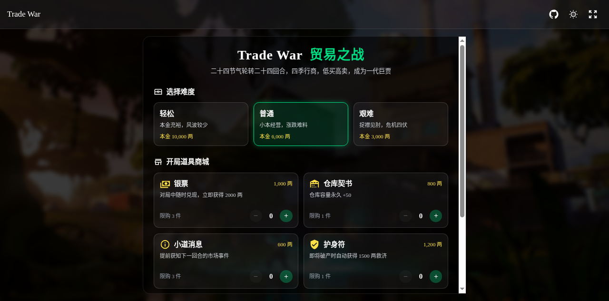
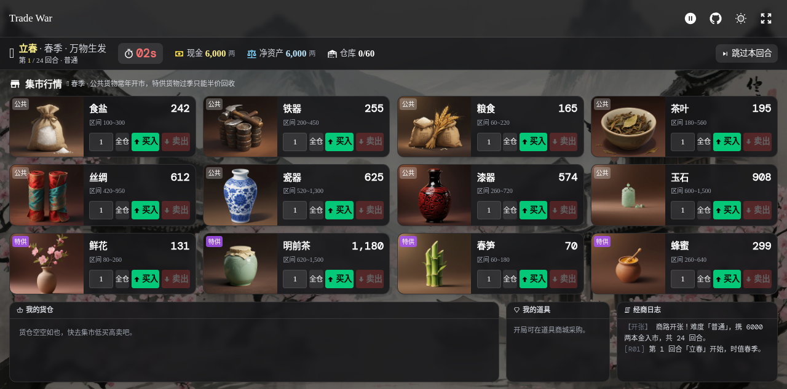
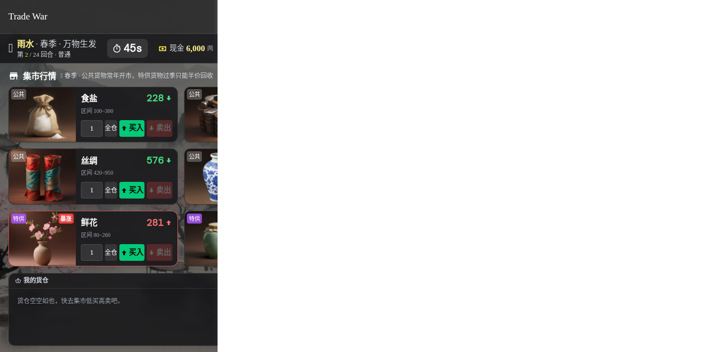

# Trade War ｜ 贸易之战

> 二十四节气轮转二十四回合，四季行商，低买高卖，成为一代巨贾。

一款以中国古代商贾为题材、围绕「二十四节气」与「四季」展开的网页版经营模拟游戏。玩家扮演行商，在春、夏、秋、冬四个场景中穿梭，依据节气更替带来的行情波动与突发事件，低买高卖、囤积居奇，撑过 24 回合并以正资产全身而退，便能跻身商贾风云榜。

基于 Vue 3 + TypeScript + UnoCSS + Vite 技术栈实现，纯前端单页应用，无需后端，开箱即玩。

---

## 目录

- [游戏简介](#游戏简介)
- [游戏截图](#游戏截图)
- [游戏玩法](#游戏玩法)
  - [开局准备：难度与道具商城](#开局准备难度与道具商城)
  - [对局流程：集市行情与买卖](#对局流程集市行情与买卖)
  - [随机事件：暴涨暴跌与横祸横财](#随机事件暴涨暴跌与横祸横财)
  - [倒计时与回合推进](#倒计时与回合推进)
  - [结算与排行榜](#结算与排行榜)
- [游戏设计](#游戏设计)
  - [技术栈](#技术栈)
  - [季节与二十四节气系统](#季节与二十四节气系统)
  - [货物系统](#货物系统)
  - [难度系统](#难度系统)
  - [道具系统](#道具系统)
  - [随机事件系统](#随机事件系统)
  - [破产与结算机制](#破产与结算机制)
  - [排行榜](#排行榜)
  - [AI 文生图资源](#ai-文生图资源)
- [本地开发](#本地开发)
- [部署](#部署)
- [License](#license)

---

## 游戏简介

**Trade War｜贸易之战** 是一款融合了中国传统文化（二十四节气）与经典经营模拟玩法的网页游戏。核心循环非常直接：

1. 开局选择难度，并用本金在道具商城采购开局道具；
2. 进入对局后，每回合（对应一个节气）在集市中买入 / 卖出 24 种货物；
3. 应对随机发生的暴涨、暴跌、横祸、横财事件，把握价格波动获利；
4. 60 秒倒计时结束自动进入下一回合，玩家也可手动跳过；
5. 24 回合（即走过完整一年二十四节气）后，若净资产为正即胜利，破产即失败；
6. 结算后可记入本地排行榜，与历史战绩一较高下。

游戏所有美术资源（四季背景、24 种货物图）均由 AI 文生图接口实时生成，风格统一为中国水墨画 / 古代商货卡牌风。

---

## 游戏截图

### 开局画面：难度选择 + 道具商城



开局弹窗展示游戏主题、三种难度卡片与五件开局道具，玩家用本金采购道具后点击「开始经商」进入对局。

### 对局进行中（桌面端）



顶部状态栏展示节气 / 回合 / 倒计时 / 现金 / 净资产 / 仓库；中部为 4×3 集市行情卡牌；底部为玩家货仓、道具与经商日志三栏。

### 对局进行中（移动端）



移动端下集市卡牌区域独立纵向滚动，底部三面板常驻，保证任何内容都可触达。

---

## 游戏玩法

### 开局准备：难度与道具商城

进入游戏后首先弹出**开局弹窗**，包含两部分：

**1. 选择难度**（三选一）

| 难度 | 描述 | 初始本金 | 仓库容量 | 事件触发率 |
| ---- | ---- | ---- | ---- | ---- |
| 轻松 | 本金充裕，风波较少 | 10,000 两 | 100 | 35% |
| 普通 | 小本经营，涨跌难料 | 6,000 两 | 60 | 45% |
| 艰难 | 捉襟见肘，危机四伏 | 3,000 两 | 40 | 60% |

切换难度会自动清空购物车，避免透支。

**2. 开局道具商城**（用本金采购，详情见 [道具系统](#道具系统)）

弹窗底部显示「采购后余银」与「开始经商 →」按钮。余额不足时无法继续加购；点击按钮正式开局。

### 对局流程：集市行情与买卖

进入对局后，界面自上而下分为三个区域：

- **顶部状态栏**：当前节气、季节与节气标语、回合数 `第 N / 24 回合`、难度、倒计时（剩余 10 秒变红）、现金、净资产、仓库容量，以及「跳过本回合」按钮。若持有「小道消息」道具，此处还会显示下回合事件密报。
- **中部集市行情**：当季在售货物以 4×3 卡牌网格展示。每张卡牌左侧为货物图（带「公共 / 特供」标签与「暴涨 / 暴跌」事件标签、持有数量），右侧为名称、当前价、价格区间，以及数量输入框、「全仓」按钮、「买入」「卖出」按钮。
- **底部玩家面板**：三栏布局 ——「我的货仓」（持仓列表，过季货物可半价回收）、「我的道具」（已拥有道具，主动道具可点击使用）、「经商日志」（按回合记录所有买卖与事件）。

**买卖操作**

- **买入**：在数量框输入或点击「全仓」一键填满可承受上限，点击「买入」。买入受现金与仓库容量双重限制；持有「折扣令牌」时买入价自动 95 折。
- **卖出**：仅可卖出当季在售的货物，按当前市价成交。
- **半价回收**：过季（不再在售）的货物无法在集市卖出，可在货仓中点击「半价回收」按半价清仓变现。

### 随机事件：暴涨暴跌与横祸横财

每回合开始时按当前难度的事件触发率掷骰，命中则触发以下四类事件之一，并以浮窗 + 日志形式播报：

| 事件类型 | 触发权重 | 效果 | 浮窗配色 |
| ---- | ---- | ---- | ---- |
| 📈 暴涨 surge | 35% | 某货物市价 ×1.7~2.2 | 红色 |
| 📉 暴跌 crash | 35% | 某货物市价 ×0.35~0.55 | 绿色 |
| ⚠️ 飞来横祸 fine | 16% | 现金 −800（加税）或 −10%（盗匪，最少 200） | 橙色 |
| 🎁 意外之喜 bonus | 14% | 现金 +500~1200 | 蓝色 |

暴涨 / 暴跌只作用于当季在售货物，且价格会被夹紧在 `[min×0.5, max×1.5]` 区间内，避免极端值。横祸导致现金归零时可能触发破产判定。

### 倒计时与回合推进

- 每回合 **60 秒**倒计时，剩余 10 秒时数字变红提示；
- 倒计时归零自动进入下一回合；玩家也可随时点击「跳过本回合」主动推进；
- 顶部导航栏提供暂停 / 继续按钮，可中途歇脚；暂停遮罩内可「继续经商」或「放弃本局」。

### 结算与排行榜

- **胜利**：撑过 24 回合且最终净资产为正，弹出 🏆「功成身退！」结算页；
- **失败**：中途破产（现金为 0 且无货可卖），弹出 💸「商海折戟……」结算页。

结算页展示坚持回合数、难度、结余现金、货仓折价与最终净资产，并可输入商名「记入排行榜」。排行榜按净资产降序保留 Top 10，持久化在浏览器 `localStorage`（键名 `trade-war-leaderboard`）。

---

## 游戏设计

### 技术栈

| 类别 | 选型 |
| ---- | ---- |
| 框架 | Vue 3（`<script setup>` + Composition API） |
| 语言 | TypeScript |
| 构建工具 | Vite 5 |
| 原子化 CSS | UnoCSS |
| 路由 | Vue Router 4（单路由 `createWebHistory('/')`） |
| 工具库 | @vueuse/core（`createGlobalState` / `useStorage` / `useColorMode` / `useFullscreen`） |
| 自动导入 | unplugin-auto-import（vue / vue-router / @vueuse/core / store） |
| 部署 | gh-pages |

项目结构概览：

```
src/
├── game/
│   ├── config.ts          # 全局常量：回合/节气/季节/难度/货物/道具/事件文案
│   ├── useGame.ts         # 游戏引擎：状态机 + 买卖 + 事件 + 结算 + 排行榜
│   └── useGeneratedImage.ts  # 文生图异步探测 Hook（占位图→真图自动刷新）
├── views/
│   ├── Game/
│   │   ├── GameMain.vue   # 对局主框架：StartScreen / StatusBar / GoodsMarket / PlayerPanel / EventToast / Settlement
│   │   ├── Home.vue       # 当季背景图 + 导航 + 内容区
│   │   └── components/    # StartScreen / StatusBar / GoodsMarket / GoodsCard / PlayerPanel / EventToast / Settlement
│   ├── Layout/            # GameNav / GameContent
│   ├── NavButton/         # ChangeGameStatus / GitHubButton / ColorSchemeToggle / FullScreenToggle
│   └── Type/index.ts      # 全部类型定义
├── router/index.ts
├── store/index.ts
├── utils/index.ts         # getAssetsFile / formatMoney / 防抖节流 / 深拷贝
└── styles/base.css
```

### 季节与二十四节气系统

- 一局共 **24 回合**，每回合对应一个节气，完整走完即一年；
- 每季 **6 回合**，顺序为：春（立春→谷雨）→ 夏（立夏→大暑）→ 秋（立秋→霜降）→ 冬（立冬→大寒）；
- 回合 → 季节映射由 `seasonOfRound(round)` 计算：`Math.floor((round - 1) / 6)`；
- 四季配置（`SEASON_LIST`）含名称、emoji、标语（如春「万物生发」、夏「烈日炎炎」、秋「丰收之时」、冬「岁末寒冬」）与 AI 生成的水墨风背景图。

### 货物系统

共 **24 种货物 = 8 公共 + 4×4 季节特供**，所有货物图统一为「单一主体居中 + 深暖炭棕渐变背景 + 柔和轮廓光」的卡牌风。

**公共货物**（四季常驻，波动率 ±13%）

| 货物 | emoji | 价格区间（两） |
| ---- | ---- | ---- |
| 食盐 | 🧂 | 100~300 |
| 铁器 | 🔩 | 200~450 |
| 粮食 | 🌾 | 60~220 |
| 茶叶 | 🍵 | 180~560 |
| 丝绸 | 🧵 | 420~950 |
| 瓷器 | 🏺 | 520~1300 |
| 漆器 | 🍶 | 260~720 |
| 玉石 | 💠 | 600~1500 |

**季节特供货物**（波动率 ±22%，过季只能半价回收）

| 季节 | 货物 |
| ---- | ---- |
| 春 🌸 | 鲜花、明前茶、春笋、蜂蜜 |
| 夏 ☀️ | 荔枝、珍珠、夏布、西瓜 |
| 秋 🍁 | 葡萄酒、香料、棉花、烟草 |
| 冬 ❄️ | 皮毛、人参、煤炭、腊肉 |

**行情滚动逻辑**（`rollPrices`）

- 在售货物每回合以 `prev × (1 ± volatility)` 随机游走，并夹紧到 `[min, max]`；
- 不在售（过季）货物标记为 `available = false`，估值按半价计算；
- 命中暴涨 / 暴跌事件时，价格再乘事件倍率，并夹紧到 `[min×0.5, max×1.5]`；
- 货物估值 `unitValue`：在售按市价，过季按 `max(price×0.5, 1)`。

### 难度系统

| 难度 key | 标签 | 初始本金 | 仓库容量 | 事件率 |
| ---- | ---- | ---- | ---- | ---- |
| easy | 轻松 | 10000 | 100 | 0.35 |
| middle | 普通 | 6000 | 60 | 0.45 |
| hard | 艰难 | 3000 | 40 | 0.60 |

难度通过 `DIFFICULTY_MAP` 配置，影响开局资金、仓库容量与每回合事件触发概率。

### 道具系统

开局可在道具商城用本金采购，单件限购，开局后无法再补购。

| 道具 | icon | 价格 | 类型 | 限购 | 效果 |
| ---- | ---- | ---- | ---- | ---- | ---- |
| 银票 coupon | cash-multiple | 1000 | 主动 | 3 | 对局中随时兑现，立即获得 2000 两 |
| 仓库契书 warehouse | warehouse | 800 | 被动 | 1 | 仓库容量永久 +50 |
| 小道消息 intel | information-outline | 600 | 主动 | 3 | 提前获知下一回合的市场事件 |
| 护身符 amulet | shield-check | 1200 | 被动 | 1 | 即将破产时自动获得 1500 两救济 |
| 折扣令牌 discount | tag | 1500 | 被动 | 1 | 整局买入价格 -5% |

- **被动道具**购买即生效（仓库契书开局直接 +50 容量，护身符在破产判定时自动触发，折扣令牌使所有买入价 ×0.95）；
- **主动道具**在对局中点击「我的道具」栏内对应卡片使用：银票立即 +2000 两，小道消息预滚下一回合事件并在状态栏显示密报。

### 随机事件系统

事件在每回合开始时由 `rollEvent(season)` 按难度事件率掷骰生成，四类事件及文案模板：

- **暴涨 surge**：从当季货物中随机选一种，倍率 1.7~2.2，文案如「富商重金囤积「{name}」，市价扶摇直上！」；
- **暴跌 crash**：倍率 0.35~0.55，文案如「今年风调雨顺，「{name}」集中上市，价格暴跌！」；
- **飞来横祸 fine**：50% 概率加税 800 两，50% 概率被盗匪劫走 10% 现金（最少 200）；
- **意外之喜 bonus**：随机获得 500~1200 两。

事件通过 `applyEvent` 应用：暴涨 / 暴跌仅影响价格并在日志标记该货物；bonus 直接加现金；fine 扣现金并可能触发破产判定。事件以顶部浮窗（`EventToast`，4.2 秒后自动隐藏）+ 日志双重播报。

### 破产与结算机制

- **破产判定**（`checkBankrupt`）：每回合事件扣款后，若现金为 0 且仓库为空即判定破产；此时若持有护身符，自动消耗一张并补 1500 两救济，避免立即失败；
- **胜利条件**：完成第 24 回合后，`cash > 0` 即胜利；
- **最终净资产**：`cash + Σ(货物估值 × 持有量)`，过季货物按半价折算；
- **结束**：`endGame('win' | 'lose')` 停止计时器、写入 `finalNetWorth` 并在日志记录结局文案。

### 排行榜

- 使用 `@vueuse/core` 的 `useStorage` 持久化到 `localStorage`（键 `trade-war-leaderboard`）；
- 每条记录含商名、难度、净资产、胜负、坚持回合数与时间戳；
- 新记录插入后按净资产降序、截取前 10 名；
- 结算页高亮当前本次记录，前三名分别显示 🥇🥈🥉 奖牌。

### AI 文生图资源

所有美术资源均通过文生图接口 `https://trae-api-cn.mchost.guru/api/ide/v1/text_to_image` 实时生成：

- **四季背景**：古代中国商镇水墨画，分别对应春（桃花薄雾）、夏（荷塘烈日）、秋（银杏枫叶）、冬（雪覆红梅）；
- **24 种货物图**：统一「单一主体居中 + 深暖炭棕渐变背景 + 柔和轮廓光 + 卡牌手绘风」规范，部分主体（玉石、鲜花、春笋、蜂蜜、人参、腊肉）使用增强反向约束版本，确保无底板 / 无画框干扰。

由于文生图为异步生成（首次返回占位图），项目封装了 `useGeneratedImage` Hook：定时（默认 6 秒）探测图片 naturalWidth 变化，最多重试 12 次，一旦检测到真图生成完成即自动刷新展示地址。

---

## 本地开发

### 环境要求

- Node.js ≥ 18
- pnpm（推荐，已附带 `pnpm-lock.yaml`）

### 安装与启动

```bash
# 安装依赖
pnpm install

# 启动开发服务器（默认 http://localhost:5173）
pnpm dev
```

### 构建与预览

```bash
# 类型检查 + 生产构建，产物输出到 dist/
pnpm build

# 本地预览构建产物
pnpm preview
```

---

## 部署

项目已配置 GitHub Pages 部署脚本（`vite.config.ts` 中 `base: './'` 使用相对路径，适配任意子路径部署）：

```bash
# 先构建（predeploy 钩子自动执行 build），再将 dist/ 推送到 gh-pages 分支
pnpm deploy
```

线上访问地址：<https://smallteddygames.github.io/trade-war/>

---

## License

[MIT](./LICENSE)
